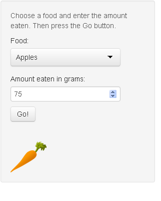

---
title       : The Daily Nutrition Tracker
subtitle    : A Slidify Presentation
author      : New Pagodi
job         : Data Science Student
framework   : io2012        # {io2012, html5slides, shower, dzslides, ...}
highlighter : highlight.js  # {highlight.js, prettify, highlight}
hitheme     : tomorrow      # 
widgets     : [mathjax]            # {mathjax, quiz, bootstrap}
mode        : selfcontained # {standalone, draft}
knit        : slidify::knit2slides
--- 

  
<style>
  .title-slide {
    background-image: url(assets/img/subtle_white_mini_waves.png);
    
  }
</style>

<style>
.custbg {
  background-image:url(assets/img/food-carrot.png); 
  background-repeat: no-repeat;
  background-position: center center;
  background-size: cover;
}
</style>


## The Problem... And a Solution

Every day we get more evidence about the importance of nutrition for maintaining a healthy body.  But keeping track of the amount nutrition you're getting from your food can be quite a task.  If only there was a tool that made this job easier.  Now there is:

<br>



#### Introducing the Daily Nutrition Tracker<br><br>

The daily nutrition tracker is a tool that makes keeping track of the amount of nutrients a person is getting easy.  Before now, this task would involve reading long and confusing nutrition labels.  And manufacturers would often play games with the serving sizes in their products so that even with a nutrition label, a person could still have to solve a math problem to figure out their nutrient levels.  To complicate things further, some foods, such as fresh foods and vegetables, don't have a label at all.<br><br>

Through a simple and familiar web browser interface, The daily nutrition tracker takes care of all of this for you.

--- 

## Easy to Use, But With Powerful Features  

The Daily Nutrition Tracker lets you track how much of **4 essential nutrients** (Vitamin A, Vitamin C, Calcium, and Iron), you are getting from the foods you eat.

#### How To Use the Tracker<br><br>

You use the left panel on the main page to enter the information.  For each food eaten, simply enter the type of food and the amount eaten in grams.  Then press the go button.

#### What Information Will Be Shown<br><br>

The information is displayed in the right panel.  As each food is entered, the tracker updates 3 sets of information.  First the tracker will give a chart showing how much of the  recommended daily allowance (RDA) of Vitamin A, Vitamin C, Calcium, and Iron that you have you have taken in.  Second, it will also give the total amounts of these nutrients you have taken in.  Finally, it will give a breakdown of that total for each food.

--- 

## How Does It Work ... Simple Math

A grapefruit has 1150 IU of vitamin A per 100 grams.  So if a user has eaten 75 grams of grapefruit today, they have gotten:


```r
1150*(75/100)
```

```
## [1] 862.5
```

IU from the grapefruit.  

Moreover, the current RDA of vitamin A is 3000 IU, so the user has gotten


```r
100*(1150*(75/100))/3000
```

```
## [1] 28.75
```

percent of their RDA for vitamin A from the grapefruit. 

--- .custbg

## Room to grow

<br>
As great as the Daily Nutrition Tracker already is, there are many more features that could be still be added.  For example, we could:

 + Add more foods
 + Allow foods to be specified in units other than grams
 + Track more nutrients
 + Add more charts and more features
   - break down total consumption by carbohydrate, fat, and protein
   - break down protein consumption by amino acid to check for completeness
 + Allow a user to specify age and weight so that recommended daily allowances can be further customized for the user
